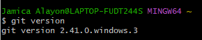
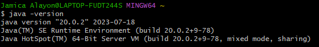
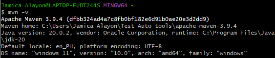
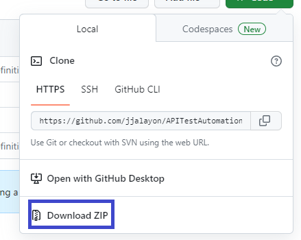
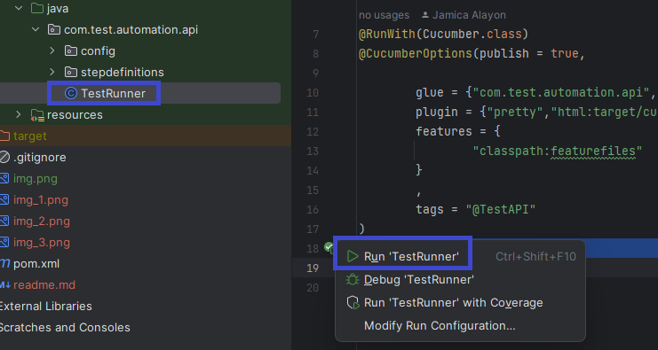
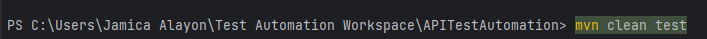
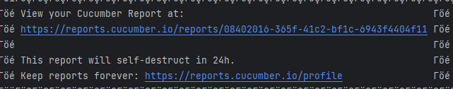
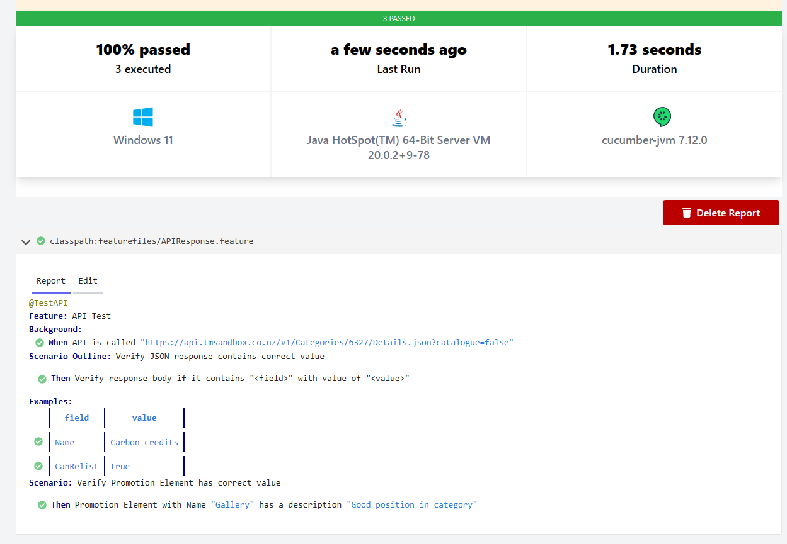

# **API TEST AUTOMATION**
This project can be used to automate API testing using different technologies such as:

* Java
* Cucumber
* Springframework
* TestNG
* JUnit
* Maven

## **Getting Started**

### GIT Installation
1. Download and Install Git on your system
   https://github.com/git-guides/install-git
2. Verify Git Installation on your system via cmd/gitbash and type `'git version'`
   

### Java Installation
1. Download and Install Java JDK version 20 or higher if available:
   https://www.oracle.com/java/technologies/downloads/
2. Set environment variable path on your syetem
   https://www.codejava.net/java-core/how-to-set-java-home-environment-variable-on-windows-10
3. Verify Java installation via cmd / gitbash and type
   `java -version`
    

### Apache Maven Installation
1. Download and Install Apache Maven version 3.9.4 or higher:
   https://maven.apache.org/install.html
2. Set environment variable path on your system
   https://www.tutorialspoint.com/maven/maven_environment_setup.html
3. Verify Maven installation via cmd / gitbash and type
    `'mvn -v'`
    

### Cloning the Project
#### via Git Command
1. Open Gitbash
2. Change the current working directory to the location where you want the cloned directory
3. Type `git clone https://github.com/jjalayon/APITestAutomation.git`
4. Wait until cloning has been completed.
5. On your local, create new branch from the local master using git command 
`git checkout -b <your_branch_name>`
6. Implement your changes on your created new branch.

#### via Manual Download from the repository
1. On Github Repository, Click Code > Download ZIP
   
2. Extract ZIP file to your local directory then Open Project using your IDE

### Running your test
#### Using TestRunner
1. Go to Test Runner file, Click play button > Click Run TestRunner

#### Using Maven Command
1. Open CMD/Gitbash and go to project's root directory and run command `'mvn clean test'`

### Test Report
This project utilizes built-in cucumber reporting

Sample Report:
